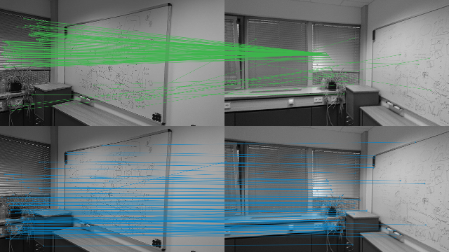

# NG-RANSAC for Epipolar Geometry from Sparse Correspondences

- [Introduction](#introduction)
- [Installation](#installation)
- [Quick Start: Demo Script](#quick-start-demo-script)
- [Code Structure](#code-structure)
- [Data Structure](#data-structure)
- [Training NG-RANSAC](#training-ng-ransac)
- [Testing NG-RANSAC](#testing-ng-ransac)
- [Pre-Trained Models](#pre-trained-models)
- [Publication](#publication)

## Introduction

Neural-Guided RANSAC (NG-RANSAC) is a general method for fitting parametric models to a set of data points that might contain outliers and noise, i.e. it is a robust estimator. 
This code provides an implementation of NG-RANSAC for fitting epipolar geometry, i.e. a fundamental matrix or an essential matrix, to a set of sparse correspondences between a pair of images. 

NG-RANSAC uses a neural network to predict a sampling probability for each data point (here: correspondence) which RANSAC uses for guided selection of minimal sets for computing model hypotheses. As in normal RANSAC, the inlier count determines the final model. 

This repository includes a selection of pre-trained networks covering a few use cases of fitting epipolar geometry. We observed good generalization of these networks, but for best results you should train NG-RANSAC an your data, using your specific task, sparse features, matching strategy and so on.

Training NG-RANSAC does not require differentiability of the components in your model fitting pipeline, e.g. the minimal solver, refinement or the loss can all be non-differentiable. NG-RANSAC can even be trained self-supervised if you have data, but no ground truth annotation. 

For more details, we kindly refer to the [paper](https://arxiv.org/abs/1905.04132). You find a BibTeX reference of the paper at the end of this readme. 

You find additional material, such as pointers to code for horizon line estimation and camera re-localization, on the NG-RANSAC [project page](https://hci.iwr.uni-heidelberg.de/vislearn/research/neural-guided-ransac/).


## Installation

NG-RANSAC is based on PyTorch, and includes a custom C++ extension which you have to compile and install (but it's easy).

NG-RANSAC requires the following python packages, and we tested it with the package version in brackets.
```
pytorch (1.2.0)
opencv (3.4.2)
```
You compile and install the C++ extension by executing:

```bash
cd ngransac
python setup.py install
```
Compilation requires access to OpenCV header files and libraries. If you are using Conda, the setup script will look for the OpenCV package in the current Conda environment. Otherwise (or if that fails), you have to set the OpenCV library directory and include directory yourself by editing the setup.py file.

If complilation succeeds, you can `import ngransac` in your python scripts. The extension provides three functions: `ngransac.find_essential_mat(...)`, `ngransac.find_fundamental_mat(...)` and `ngransac.gt_dist(...)`. Check our python scripts or the documentation in `ngransac.cpp` for reference how to use these functions.

## Quick Start: Demo Script

The demo script `ngransac_demo.py` lets you visually compare RANSAC and NG-RANSAC on a pair of images. You can provide your own images, or use the example images of this respository. For NG-RANSAC, you can provide your own network if you trained one, or the demo script will load an appropriate pre-trained model.

To run the demo with standard settings, call:


```bash
python ngransac_demo.py -img1 images/demo1.jpg -fl1 900 -img2 images/demo2.jpg -fl2 900
```
where `fl` stands for focal length. This will extract 2000 SIFT features per image, do a nearest neighbour matching, and run NG-RANSAC with a pre-trained model to fit an essential matrix. It will also run OpenCV RANSAC for comparison. The script stores a visualization of the result as `demo.png`:



The top part shows the inliers of the model found by OpenCV RANSAC (green), the bottom part shows the inliers of the model found by NG-RANSAC (blue).

Execute `python ngransac_demo.py -h` to see all parameter options you can play around with. Another example:

```bash
python ngransac_demo.py -img1 images/demo1.jpg -img2 images/demo2.jpg -orb -nf -1 -r 0.8 -fmat -t 1
```

This will extract an unrestricted number of ORB features, filters feature matches with Lowe's ratio criterion using a threshold of 0.8, and runs NG-RANSAC to fit a fundamental matrix using an inlier threshold of 1px.

The demo script is a good reference to understand how to prepare data as input for NG-RANSAC, starting from the raw images.

## Code Structure

This repository contains:

-------

`images/` -- folder contains some images for the demo script  
`models/` -- folder contains a selection of pre-trained models  
`ngransac/` -- folder contains the NG-RANSAC C++ extension  

`ngransac_demo.py` -- demo to execute NG-RANSAC for a pair of images  
`demo.png` -- example output of ngransac_demo.py  

`ngransac_train_e2e.py` -- training NG-RANSAC end-to-end (according to Eq. 4 of the paper)  
`ngransac_train_init.py` -- initializing the NG-RANSAC network (see supplement of the paper)  
`ngransac_test.py` -- batch testing of NG-RANSAC for entire datasets, used for quantitative evaluation  
`show_mean.py` -- utility script to calculate the mean evaluation measures over multiple datasets  

`dataset.py` -- dataset class for access to pre-computed correspondences, used for training and testing NG-RANSAC  
`network.py` -- network class used by NG-RANSAC that predicts sampling probabilities for sets of correspondences  
`util.py` -- collection of utility functions such as calculating pose losses, normalizing correspondences etc.  

`prepare_data_kitti.py` -- example script showing how to pre-compute and store correspondences for the Kitti odometry dataset  

`README.md` -- this documentation  

-------
The core of the code are the scripts `ngransac_train_init.py` and `ngransac_train_e2e.py` for training NG-RANSAC, and `ngransac_test.py` for quantitative evaluation. These three main scripts operate on pre-computed sets of correspondences, to avoid repeated feature detection and matching. We will discuss the structure of the pre-computed data next, before explaining how to train and test NG-RANSAC using this data.


## Data Structure

We provide pre-computed correspondences for the datasets used in our paper which can be used to reproduce our results, for reference of how to prepare data for NG-RANSAC, or as basis to train your own robust estimator.

```bash
wget -O traindata.tar.gz https://cloudstore.zih.tu-dresden.de/index.php/s/Gj28LoQjkf9qO5c/download
tar -xzvf traindata.tar.gz
rm traindata.tar.gz
```

Executing the commands above should create a new folder `traindata/` that contains pre-computed correspondences for the 24 datasets used in our experiments of Sec. 4.1 and 4.2 of the NG-RANSAC paper. The folder is structured as follows:

```
traindata\<dataset_name>\<data_variant>\<image_pair>.npy
```

`<dataset_name>` specifies one of the 24 datasets used in our experiments. Particularly, it contains 7 outdoor scenes from two structure-from-motion datasets, 16 indoor scenes from the SUN3D dataset, and the Kitti odometry dataset. See the paper for details. Note that we do not and cannot provide the original datasets but just pre-computed correspondences (along with ground truth transformations).

`<data_variant>` distinguishes between training, validation and test data (we provide only training **or** test data for each dataset, and a validation set only for `reichstag`), and the sparse feature type that was used to find correspondences. We provide correspondences calculated from SIFT features (default), RootSIFT features (marked `_rs`) and ORB features (marked `_orb`).

`<image_pair>.npy` contains the actual correspondences stored in the standard numpy array format. The array stored has the form:

```python
[pts1, pts2, sideinfo, img1size, img2size, K1, K2, R, t]
```

`pts1` / `pts2` -- the x,y-coordinates of feature matches in image 1 and image 2 in pixels, both arrays have the same size; the number of points/matches may vary between image pairs  
`sideinfo` -- side information about each match such as quality measures, we store matching ratios i.e. the descriptor distance ratio of the best and second best match, i.e. we store one additional number per match  
`img1size` / `img2size` -- image size (height amd width) of the original images in pixels  
`K1` / `K2` -- `3x3` calibration matrices corresponding to image 1 and image 2  
`R`  -- `3x3` rotation matrix (ground truth relative rotation between image 1 and image 2)  
`t`  -- `3x1` translation matrix (ground truth relative translation between image 1 and image 2)

For reference, this repository includes the script `prepare_data_kitti.py` that we used to pre-compute correspondences for the [Kitti odometry dataset](http://www.cvlibs.net/datasets/kitti/eval_odometry.php). Download the grayscale data, calibration files and ground truth poses, and you can exectue

```bash
python prepare_data_kitti.py -ds <kitti_folder> -v train
python prepare_data_kitti.py -ds <kitti_folder> -v test
```

Note that this will overwrite our pre-computed correspondences in the `traindata` folder, if you have downloaded our data package.

## Training NG-RANSAC

With pre-computed correspondences prepared in the folder `traindata/` you can train NG-RANSAC. Training takes place in two stages: Initialization and end-to-end training. 

For initialization, execute `ngransac_train_init.py`. This stage optimizes the KL-divergence of the sampling weights predicted by the neural guidance network, and a target distribution caclulated using the epipolar distance of a feature match to a ground truth model. The initalization is particularly useful if your data contains many outliers. In this case, end-to-end training from scratch can take a very long time, and the initialization helps to bring the neural guidance network to a useful state in a sensible time. If your data contains few outliers (e.g. if you apply Lowe's ratio filter) or if you want to train self-supervised, you can skip the initialization.

For end-to-end training, execute `ngransac_train_e2e.py`. This stage optimizes the quality of an estimated model directly, using a task loss, i.e. a loss defined on the estimated model.

Both training scripts store a log `.txt` file with the training iteration number, and training loss in each line. The scripts will also store the model parameters after each epoch to a `.net` file containing the PyTorch model `state_dict`.

Execute both training scripts with the `-h` parameter to see all command line options, and standard values. The most important parameters are:

`--datasets` -- a list of datasets to be used for training, separated by commata; the dataset names should correspond to folders in `traindata/`  
`-orb`, `-rs` -- to use ORB or RootSIFT correspondences, default is SIFT; note that these options merely control which folder in `traindata/` is accessed; you have to pre-compute all respective correspondences (see [section above](#data-structure))  
`--model` -- model file name to load and continue training, e.g. to load a model from the initialization stage for end-to-end training; if empty, the script will create a new model  
`--loss` -- selecting the loss to use for end-to-end training. We implemented `pose`: the angular error of the estimated pose; `f1`: the overlap of inliers of the estimated model and the ground truth model (only for fundamental matrices); `epi`: the epipolar error of estimated inlier to the ground truth model (only for fundamental matrices); `inliers`: the percentage of inlier of the estimated model, this is an self-supervied loss  
`-fmat` -- if provided, NG-RANSAC is trained to estimate fundamental matrices using the 7-point algoritm rather than essential matrices using the 5-point algorithm

For example, to reproduce our best model for essential matrix estimation, you would call:

```bash
python ngransac_train_init.py -rs -r 0.8
python ngransac_train_e2e.py -rs -r 0.8 -m weights_init_E_rs_r0.80_.net
```
This will train a network for essential matrix estimation using RootSIFT correspondences on the standard training sets (one indoor, one outdoor), using Lowe's ratio criterion with a threshold of 0.8, and using the (supervised) angular pose error as training loss. The resulting network will be stored as `weights_e2e_E_rs_r0.80_.net`.

Note that the model file name (as well as log file names etc.) reflect the most important parameter values, such as feature type (ORB, SIFT, RootSIFT), model type (E vs. F matrix) and ratio filter setting. However, not all parameter settings are encoded in the file names. You can append a custom string via `-sid <string>` if you want to distinguish mutliple training sessions in the file names.

## Testing NG-RANSAC

The test script `ngransac_test.py` loads a trained model and performs a quantitative evaluation corresponding to the main experiments in our paper. Like the training scripts, testing operates on the pre-computed correspondences in the `traindata` folder. Call the test script with `-h` to see a listing of all supported command line arguments.

Evaluation results are stored per dataset within a new folder named `results/`. 

For essential matrix estimation, the result files contain three numbers which correspond to the AUC of the cumulative angular pose error up to a threshold of 5, 10 and 20 degree. Note that we adhere to the protocol of Yi et al., "Learning to find good correspondences", CVPR 2018 when calculating the AUC to ensure comparability. They use a bin size of 5 degree when calculating the cumulative error histogram, which results in a coarse approximation of the real AUC. Our scripts allow you to use a finer bin size for accurate AUC values, but be aware that these values will not be comparable to the results reported by Yi et al., or in our paper.

For fundamental matrix estimation, the result files contain four additional numbers, corresponding to the evaluation protocol of Ranftl and Koltun, "Deep Fundamental Matrix", ECCV 2018. Namely, the inlier percentage of the estimated model, the F1 score between estimated and ground truth inliers, the mean epipolar error of estimated inliers, and the median epipolar error.


For the most common case, and using the trained model of the previous section, you would call:
```bash
python ngransac_test.py -rs -r 0.8 -m weights_e2e_E_rs_r0.80_.net -bm
```
Note the `-bm` option which stand for batch mode. In this mode, the script will iterate over the 21 test datasets used in the main experiments of our paper, Sec. 4.1. For convenience, we also include the script `show_mean.py` which calculates the mean AUC values over the 21 test datasets correspondening to batch mode by reading the associated files in `results/`. E.g. you could show the mean results of the evaluation run above by calling:
```bash
python show_mean.py -rs -r 0.8 
```

Alternatively you can specify a specific dataset for testing via `-ds <dataset>`:
```bash
python ngransac_test.py -r 0.8 -fmat -ref -t 0.1 -sid kitti_inliers -ds kitti
```

This call would evaluate one of our pre-trained models (see [next section](#pre-trained-models)) for fundamental matrix estimation on the Kitti dataset. Note that we did not specify a model name here. In this case, the script infers one of our pre-trained models from the other parameter settings, and will try to load that model from the `models/` folder.

## Pre-Trained Models

We provide the following pre-trained models which you find in the `models/` folder.

Models trained for wide-baseline essential matrix estimation on one outdoor and one indoor dataset (see the paper Sec. 4.1 for details), using the angular pose error as loss:

1. `weights_e2e_E_orb_r1.00_.net` -- ORB correspondences  
2. `weights_e2e_E_orb_r0.80_.net` -- ORB correspondences and Lowe's ratio filter  
3. `weights_e2e_E_r1.00_.net` -- SIFT correspondences  
4. `weights_e2e_E_r0.80_.net` -- SIFT correspondences and Lowe's ratio filter  
5. `weights_e2e_E_rs_r1.00_.net` -- RootSIFT correspondences  
6. `weights_e2e_E_rs_r0.80_.net` -- RootSIFT correspondences and Lowe's ratio filter  

Models 3., 4. and 6. correspond to *SIFT+NG-RANSAC(+SI)*, *SIFT+Ratio+NG-RANSAC(+SI)* and *RootSIFT+Ratio+NG-RANSAC(+SI)* of Fig. 2b of the paper\*.


Similar models, but trained for fundamental matrix estimation on the same datasets:

`weights_e2e_F_orb_r1.00_.net`  
`weights_e2e_F_orb_r0.80_.net`  
`weights_e2e_F_r1.00_.net`  
`weights_e2e_F_r0.80_.net`  
`weights_e2e_F_rs_r1.00_.net`  
`weights_e2e_F_rs_r0.80_.net`  

Models trained for narrow-baseline fundamental matrix estimation on Kitti (see the paper Sec. 4.2 for details). These models correspond to the models in Fig. 4 of the paper\*.:

`weights_e2e_F_r0.80_kitti_f1.net` -- using the F1 score as training loss  
`weights_e2e_F_r0.80_kitti_epi.net` -- using the mean epipolar error of inliers as loss  
`weights_e2e_F_r0.80_kitti_inliers.net` -- using the inlier count of the estiamted model as loss (self-supervised) 

We observed good generalization of these models. You can try them in your application, either by adapting the demo script or the test script, as an indication whether you would benefit from NG-RANSAC. However, to achieve best results, we strongly recommend to train your own model on your data and using the specificities of your model fitting pipeline (features, matching, minimal solver, refinement, task loss, etc.).

\*) We re-trained all models using this cleaned-up, public version of the code, so results can vary slightly compared to the paper. 

## Publication

Please cite the following paper if you use NG-RANSAC or parts of this code in your own work.

```
@inproceedings{brachmann2019ngransac,
  title={{N}eural- {G}uided {RANSAC}: {L}earning Where to Sample Model Hypotheses},
  author={Brachmann, Eric and Rother, Carsten},
  booktitle={ICCV},
  year={2019}
}
```